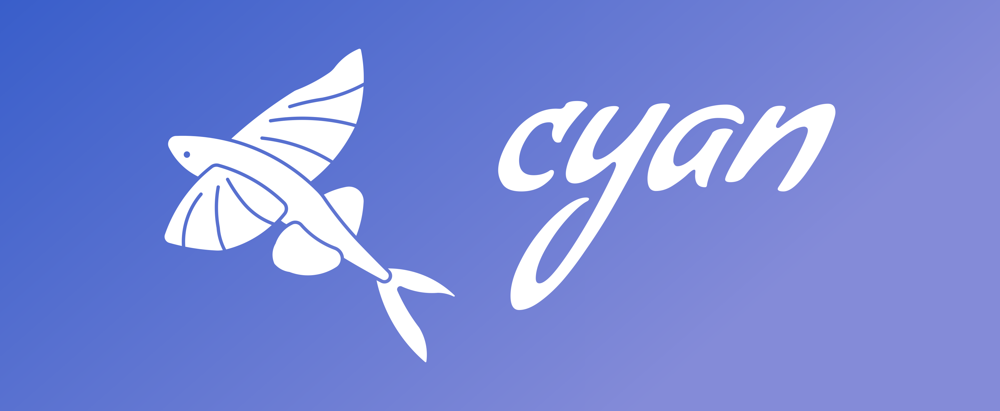

## About

A social media client for interacting with the Nostr network - built using [Rust](https://www.rust-lang.org/), [Tauri](https://tauri.app/), [SvelteKit](https://kit.svelte.dev/) and [Skeleton](https://www.skeleton.dev/).

## Development

Feel free to contribute, by creating a [issue](https://github.com/jonassterud/cyan/issues) and/or submitting a [pull request](https://github.com/jonassterud/cyan/pulls).

Use [convential commits](https://www.conventionalcommits.org/en/v1.0.0/#summary), where type is one of the following: `feat`, `fix`, `refactor` or `docs`.

Check out [ARCHITECTURE](ARCHITECTURE.md) for an explanation of how everything works together.

### Useful resources
* [Tauri (beta)](https://beta.tauri.app/2/guide/)
* [SvelteKit](https://svelte.dev/docs/introduction)
* [SvelteKit with Tauri](https://tauri.app/v2/guides/getting-started/setup/sveltekit)
* [Skeleton](https://www.skeleton.dev/docs/quickstart)
